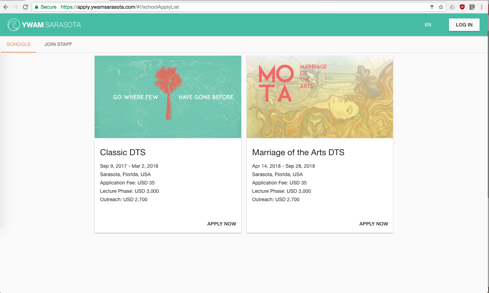

The goal of this project is a real-time, mobile first, web/app solution for common information challenges at YWAM bases. This project is built to be deployed on Google's Firebase services, an inexpensive easy way for any base to get up and running with their own information system.

This collection of features aims to cover the most common logistics at a most YWAM bases, while also utalizing existing services that are already excellent and reasonably priced for all sized bases, ex. Slack, Stripe, etc.

| Features | |
| --- | --- |
| Base Setup | In Development #106 |
| WebChat | Planned |

# Getting Started

Tools needed to run this app:
* `node` and `npm` https://nodejs.org/
Once you have these, install the following as globals:  
`npm install -g gulp webpack firebase-tools firebase-bolt`

* `clone` or `fork`  this repo
* `cd` to the root of the repository 
* `npm install` to install dependencies

### preview the App locally
we use Gulp to build and launch the development environment. Running `gulp serve` will launch a development server, and watch all file changes. The port will be displayed in the terminal.

### brand App for your base
Add brand primary and secondaring colors 

Add logos
- /assets/logos/logo_black_square.png
- /assets/logos/logo_white_square.png
- /assets/logos/logo_black_horizonal.png
- /assets/logos/logo_white_horizonal.png

## Bundle for production

runing `gulp webpack` will bundle the app and save the results in the `/dist` directory  
Change the config in index.html to use your own firebase connection. 
 
## Deploy to Firebase hosting
if you did not previously install firebase tools do so now.
`sudo npm install -g firebase-tools firebase-bolt`

cd into your project directory and run the command:
`firebase login` then

open `.firebaserc` and change the "default": value to be that of your firebase project name

Ready cloud functions for deploy 
cd into `functions/` directory and run `npm install`

Finally run `firebase deploy` to push up all files in the /dist folder to firebase hosting, set the firebase database rules, and deploy all cloud functions. 

_

__
# Angular Material Color Theming
## Color Theme Generator
https://angular-md-color.com/#/

Are you a developer?
Feel free to help us out! 
See our [developers wiki](https://github.com/timtimmytime/ywam-firebase/wiki)

While this webapp as been writen with angular v1 we will be switching to Vue.js in the future

